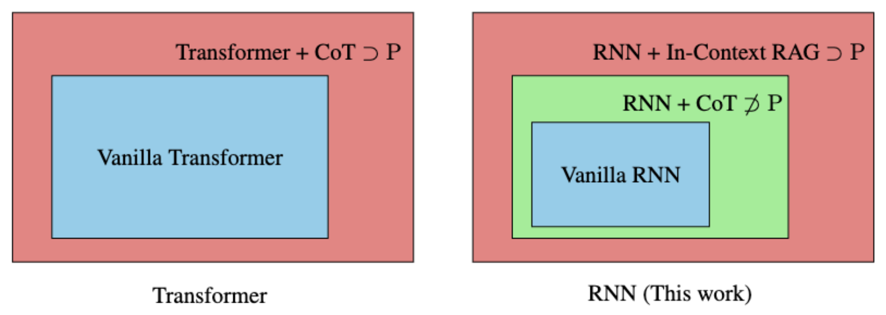
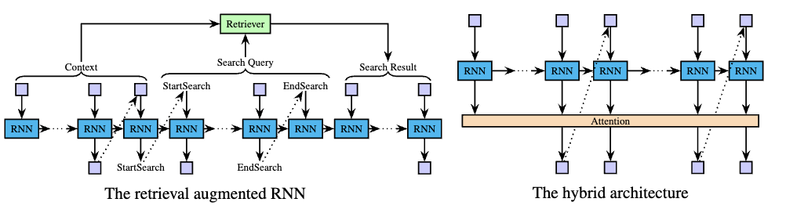

# rnn-icrag
**Official Repository for the Paper "RNNs Are Not Transformers (Yet): The Key Bottleneck on In-context Retrieval"**





## About
This repository serves as the official codebase supporting the experimental work presented in "RNNs Are Not Transformers (Yet): The Key Bottleneck on In-context Retrieval." It provides the codebase for our experiments on `IsTree`, including data generation, model training, and evaluation protocols. 

## Installation

The repository depends on [mamba](https://github.com/state-spaces/mamba). Please ensure it is installed prior to proceeding. Should Mamba not be present on your system, it can be installed with the following command, with additional reference to mamba's repository for its prerequisites:

```
pip install mamba-ssm
```

Additional dependencies include:

- transformers
- torch
- wandb
- tqdm

Subsequently, build from source using `pip install .` from within this repository.

## Data Generation

To generate a dataset for the istree task, employ the following command:
```
python rnn/data.py \
    --n_nodes 32 \
    --graph_type binary \
    --task_type cot \
    --size 1000000
```

## Training

For training an RNN model, use:
```
python3 rnn/train_upd.py \
    --model_type rnn \
    --dataset_dir your_dataset_path \
    --output_dir your_output_path \
    --model_config_path ./configs/0.5m_rnn.json \
    --batch_size 64 \
    --total_training_samples 5000000 \
    --lr 0.0003
```

To train a Transformer model:
```
python3 rnn/train_upd.py \
    --model_type transformer \
    --dataset_dir your_dataset_path \
    --output_dir your_output_path \
    --model_config_path ./configs/0.5m_transformer.json \
    --batch_size 64 \
    --total_training_samples 5000000 \
    --lr 0.001
```

To train a Hybrid model:
```
python3 rnn/train_upd.py \
    --model_type hybrid \
    --dataset_dir your_dataset_path \
    --output_dir your_output_path \
    --model_config_path ./configs/0.5m_hybrid.json \
    --batch_size 64 \
    --total_training_samples 5000000 \
    --lr 0.0003 
```

All model configurations utilized in our experiments are contained within `./configs`.

## Evaluation
For model evaluation, the following command is provided:
```
python3 rnn/val.py \
    --model_type rnn \
    --dataset_dir your_dataset_path \
    --output_dir your_eval_output_path \
    --model_dir your_model_path \
    --model_config_path ./configs/1m_rnn.json \
    --batch_size 1
```

In our experiments, we use `evaluate_through_generation` for the cot/icr task, focusing solely on the accuracy of the final results.
